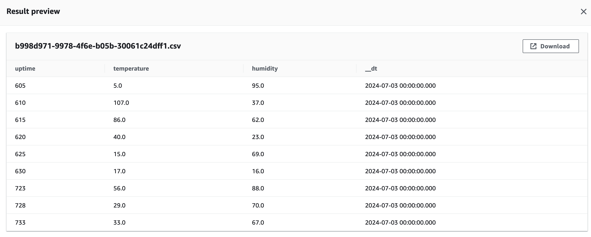
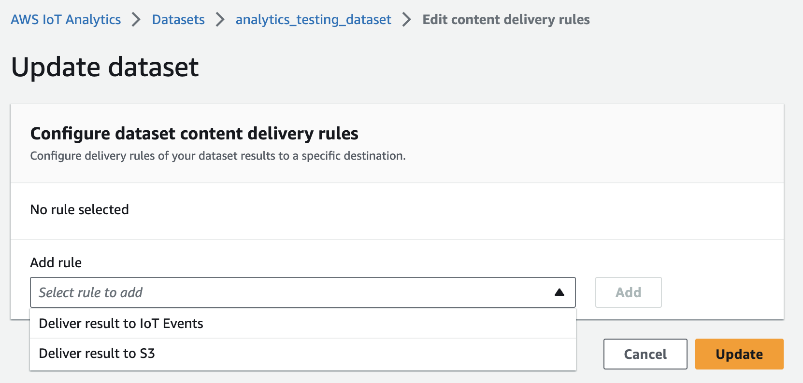

# ESP8266 AWS IoT Analytics Example

This example demonstrates how to connect an ESP8266 to AWS IoT using MQTT and send fake data to AWS IoT Analytics for visualization. The sketch includes WiFi connection setup, time synchronization using NTP, and secure communication using certificates.


## Format of Fake Data
The fake data published to AWS IoT is in JSON format and includes the following fields:

- `uptime`: The uptime of the device in seconds.
- `temperature`: A randomly generated temperature value.
- `humidity`: A randomly generated humidity value.

```json
{
  "uptime": 12345,
  "temperature": 23.45,
  "humidity": 56.78
}
```

## Visualizing incoming data
The data stored in the dataset files can be further used in a data pipeline. Lambdas can be used to manipulate this data and feed it to a data lake, for example.


## Example of a simple Lambda function to manipulate incoming data from IoT Analytics
```js
// Handler called by IoT Analytics
exports.handler = function handler(event, context, callback) {
    
//add timesteamp to incoming data and name it "ServersideTimestamp"
        event[0].ServersideTimestamp = Date.now();
        
        // Return the data        
        callback(null, event);
};
```

## Sending data to an S3 bucket
