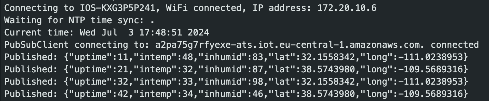
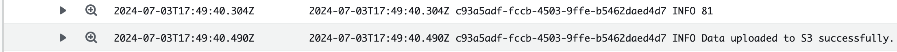
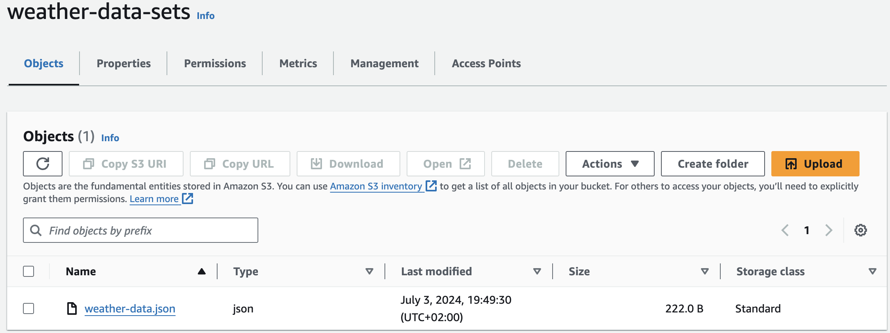

# ESP8266 to AWS IoT Core Connection and Data Processing with Lambda

## Overview

This repository contains code to connect an ESP8266 microcontroller to AWS IoT Core using MQTT, and to handle the data sent by the ESP8266 using an AWS Lambda function. The Lambda function processes the incoming data, fetches weather information, and stores the processed data in S3.

## Contents

1. **ESP8266-aws-iot-gps-example.c**: Main code to connect the ESP8266 to AWS IoT Core.
2. **index.js**: Code to create an AWS Lambda function for processing data from the ESP8266.

## ESP8266-aws-iot-gps-example.c

This script is responsible for connecting the ESP8266 to AWS IoT Core using MQTT. It allows the ESP8266 to send data (e.g., GPS coordinates) to AWS IoT Core. Ideally it should be integrated with a GPS module, but for now it generates the data randomly.

## index.js

This script is used to create an AWS Lambda function that processes the data sent by the ESP8266. It performs the following tasks:

1. **Receive Data**: The Lambda function receives data from AWS IoT Core. The data typically includes GPS coordinates (latitude and longitude).
2. **Fetch City and State**: Using the `cities` module, the Lambda function translates the GPS coordinates into a city and state.
3. **Fetch Weather Information**: Using the `weather-js` module, the Lambda function fetches the current weather information (temperature and humidity) for the identified city and state.
4. **Add Timestamp**: The Lambda function adds a timestamp to the data in ISO8601 format.
5. **Return Processed Data**: The Lambda function returns the processed data, which includes the original information, weather data, and timestamp.

## AWS CLI Commands for Lambda Permissions

To enable the Lambda function to be triggered by IoT Analytics for data visualization purposes, use the following AWS CLI commands to add the necessary permissions:

```
aws lambda add-permission --function-name <name> --region <region> --statement-id <id> --principal iotanalytics.amazonaws.com --action lambda:InvokeFunction
```

## Integration flow
### ESP8266 connection and events


### Lambda invocation logs (CloudWatch)


### S3 files upload
